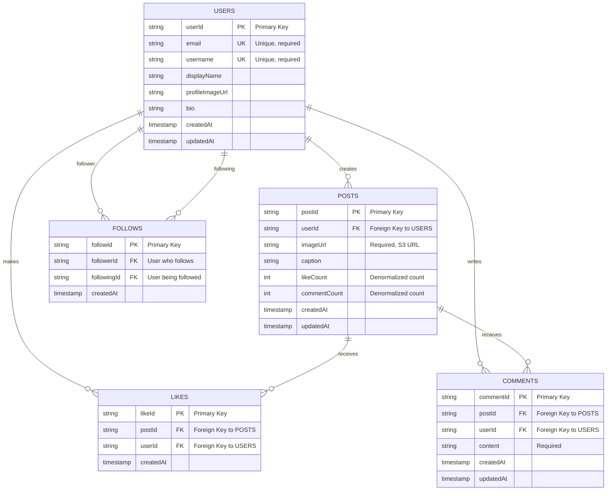

# Database ERD - Social Media App

This diagram shows the entity relationships for the Instagram-like social media application.

## Key Design Decisions

### Users Table
- Stores user profile information
- `email` and `username` are unique identifiers
- `profileImageUrl` points to profile picture in S3

### Posts Table
- Each post belongs to one user
- `imageUrl` stores the S3 location of the uploaded image
- `likeCount` and `commentCount` are denormalized for performance (avoid counting on every query)

### Likes Table
- Junction table between USERS and POSTS
- Composite unique constraint on (postId, userId) prevents duplicate likes
- Stores when the like was created

### Comments Table
- Stores text comments on posts
- Each comment belongs to one user and one post
- `content` stores the comment text
- Supports `updatedAt` for edit functionality

### Follows Table
- Self-referential relationship on USERS table
- `followerId` is the user who is following
- `followingId` is the user being followed
- Composite unique constraint on (followerId, followingId) prevents duplicate follows

## DynamoDB Implementation Notes

Since this appears to be an AWS project using DynamoDB, here are implementation considerations:

### Access Patterns
1. Get user profile → `userId` as PK
2. Get user's posts → GSI: `userId-createdAt`
3. Get post details → `postId` as PK
4. Get post likes → GSI: `postId-createdAt`
5. Get post comments → GSI: `postId-createdAt`
6. Get user's followers → GSI: `followingId-createdAt`
7. Get users a user follows → GSI: `followerId-createdAt`
8. Check if user likes post → Query with composite key
9. Check if user follows another → Query with composite key

### Table Structure
- Single table design or multiple tables depending on access patterns
- Consider using GSIs (Global Secondary Indexes) for reverse lookups
- Use composite sort keys for pagination and filtering