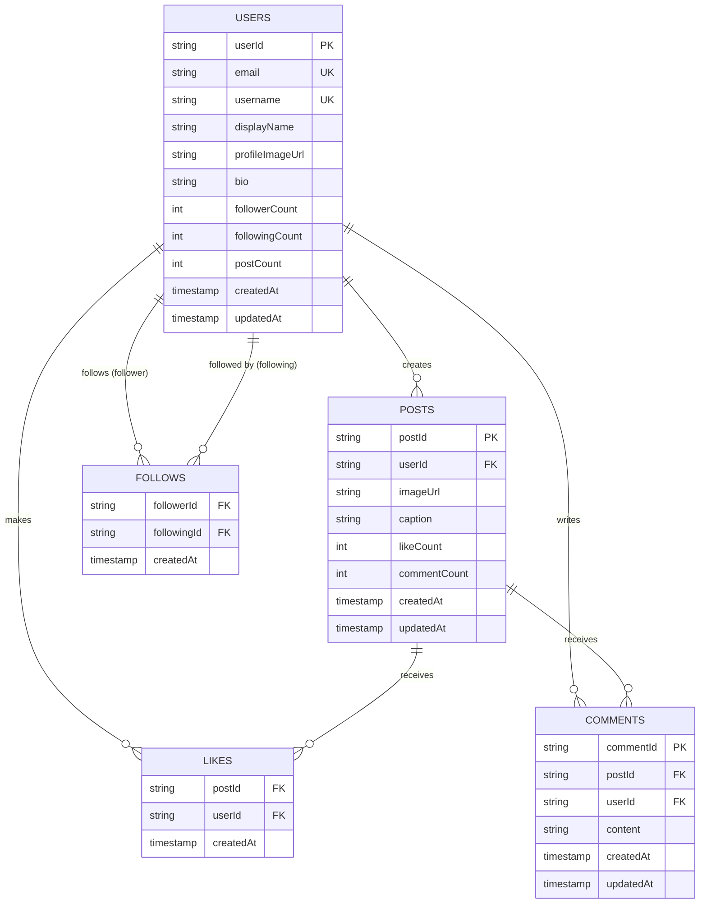

# Database Design - Social Media App (DynamoDB Single-Table Design)

This document details the DynamoDB single-table design for an Instagram-like social media application.

## Entity Relationship Diagram



---

## DynamoDB Single Table Design

### Table Name: `SocialMediaApp`

All entities are stored in a single table with the following structure:

| Attribute | Type | Description |
|-----------|------|-------------|
| PK | String | Partition Key |
| SK | String | Sort Key |
| GSI1PK | String | GSI1 Partition Key |
| GSI1SK | String | GSI1 Sort Key |
| GSI2PK | String | GSI2 Partition Key |
| GSI2SK | String | GSI2 Sort Key |
| GSI3PK | String | GSI3 Partition Key |
| GSI3SK | String | GSI3 Sort Key |
| entityType | String | Type of entity (USER, POST, LIKE, COMMENT, FOLLOW) |
| ...attributes | Various | Entity-specific attributes |

---

## Access Patterns and Key Design

### 1. USER Entity

#### User Profile
```
PK: USER#<userId>
SK: PROFILE
GSI1PK: USERNAME#<username>
GSI1SK: USER
GSI2PK: EMAIL#<email>
GSI2SK: USER

Attributes:
- userId
- email
- username
- displayName
- profileImageUrl
- bio
- followerCount (denormalized)
- followingCount (denormalized)
- postCount (denormalized)
- createdAt
- updatedAt
- entityType: "USER"
```

**Access Patterns:**
- Get user by userId: `Query(PK=USER#<userId>, SK=PROFILE)`
- Get user by username: `Query(GSI1, GSI1PK=USERNAME#<username>)`
- Get user by email: `Query(GSI2, GSI2PK=EMAIL#<email>)`

---

### 2. POST Entity

#### Post Metadata
```
PK: POST#<postId>
SK: METADATA
GSI1PK: USER#<userId>
GSI1SK: POST#<timestamp>
GSI3PK: FEED
GSI3SK: POST#<timestamp>

Attributes:
- postId
- userId
- imageUrl
- caption
- likeCount (denormalized)
- commentCount (denormalized)
- createdAt
- updatedAt
- entityType: "POST"
```

**Access Patterns:**
- Get post by postId: `Query(PK=POST#<postId>, SK=METADATA)`
- Get all posts by user: `Query(GSI1, GSI1PK=USER#<userId>, GSI1SK begins_with POST#)`
- Get global feed (all posts): `Query(GSI3, GSI3PK=FEED, GSI3SK begins_with POST#)`

---

### 3. LIKE Entity

```
PK: POST#<postId>
SK: LIKE#<userId>
GSI1PK: USER#<userId>
GSI1SK: LIKE#<timestamp>#<postId>

Attributes:
- postId
- userId
- createdAt
- entityType: "LIKE"
```

**Access Patterns:**
- Get all likes for a post: `Query(PK=POST#<postId>, SK begins_with LIKE#)`
- Check if user liked a post: `GetItem(PK=POST#<postId>, SK=LIKE#<userId>)`
- Get all posts a user liked: `Query(GSI1, GSI1PK=USER#<userId>, GSI1SK begins_with LIKE#)`
- Add a like: `PutItem` with condition expression to prevent duplicates
- Remove a like: `DeleteItem(PK=POST#<postId>, SK=LIKE#<userId>)`

---

### 4. COMMENT Entity

```
PK: POST#<postId>
SK: COMMENT#<timestamp>#<commentId>
GSI1PK: USER#<userId>
GSI1SK: COMMENT#<timestamp>#<postId>

Attributes:
- commentId
- postId
- userId
- content
- createdAt
- updatedAt
- entityType: "COMMENT"
```

**Access Patterns:**
- Get all comments for a post (chronological): `Query(PK=POST#<postId>, SK begins_with COMMENT#)`
- Get all comments by a user: `Query(GSI1, GSI1PK=USER#<userId>, GSI1SK begins_with COMMENT#)`
- Get specific comment: `Query(PK=POST#<postId>, SK=COMMENT#<timestamp>#<commentId>)`
- Update comment: `UpdateItem`
- Delete comment: `DeleteItem`

---

### 5. FOLLOW Entity

#### Following Relationship
```
PK: USER#<followerId>
SK: FOLLOWING#<followingId>
GSI1PK: USER#<followingId>
GSI1SK: FOLLOWER#<followerId>

Attributes:
- followerId (user who follows)
- followingId (user being followed)
- createdAt
- entityType: "FOLLOW"
```

**Access Patterns:**
- Get all users that userA follows: `Query(PK=USER#<userA>, SK begins_with FOLLOWING#)`
- Get all followers of userB: `Query(GSI1, GSI1PK=USER#<userB>, GSI1SK begins_with FOLLOWER#)`
- Check if userA follows userB: `GetItem(PK=USER#<userA>, SK=FOLLOWING#<userB>)`
- Follow user: `PutItem` with condition expression to prevent duplicates
- Unfollow user: `DeleteItem(PK=USER#<userA>, SK=FOLLOWING#<userB>)`

---

## Global Secondary Indexes

### GSI1: User-Entity Index
- **Purpose**: Query entities by user (user's posts, likes, comments, follows)
- **PK**: GSI1PK
- **SK**: GSI1SK
- **Projection**: ALL

### GSI2: Email/Username Lookup
- **Purpose**: Find users by email or username
- **PK**: GSI2PK
- **SK**: GSI2SK
- **Projection**: ALL

### GSI3: Feed Index
- **Purpose**: Global feed of all posts sorted by timestamp
- **PK**: GSI3PK
- **SK**: GSI3SK
- **Projection**: ALL

---

## Key Design Patterns

### 1. Composite Sort Keys
Sort keys use composite patterns for efficient querying and sorting:
- `LIKE#<userId>` - Enables checking if specific user liked a post
- `COMMENT#<timestamp>#<commentId>` - Chronological ordering with unique identifier
- `FOLLOWING#<followingId>` - Direct relationship lookup

### 2. Denormalization
Counts are denormalized to avoid expensive count operations:
- `likeCount` on POST entity
- `commentCount` on POST entity
- `followerCount` on USER entity
- `followingCount` on USER entity
- `postCount` on USER entity

**Update Strategy**: Use DynamoDB Streams + Lambda to update counts atomically

### 3. Prevent Duplicates
Use condition expressions on PutItem:
```typescript
// Prevent duplicate likes
PutItem({
  Item: { PK: 'POST#123', SK: 'LIKE#user456', ... },
  ConditionExpression: 'attribute_not_exists(PK)'
})

// Prevent duplicate follows
PutItem({
  Item: { PK: 'USER#user123', SK: 'FOLLOWING#user456', ... },
  ConditionExpression: 'attribute_not_exists(PK)'
})
```

### 4. Efficient Pagination
All queries support pagination using `LastEvaluatedKey`:
- Comments sorted by timestamp
- Posts sorted by timestamp
- Likes can be paginated
- Followers/following lists can be paginated

---

## Example Queries

### Get User Feed (Posts from Users They Follow)
1. Query following list: `Query(PK=USER#<currentUser>, SK begins_with FOLLOWING#)`
2. For each following user, query their posts: `Query(GSI1, GSI1PK=USER#<followingId>, SK begins_with POST#)`
3. Merge and sort by timestamp on client side
4. *Alternative*: Use DynamoDB Streams to maintain a denormalized feed table

### Get Post with Details
```typescript
// Get post metadata
const post = await query({
  PK: 'POST#123',
  SK: 'METADATA'
})

// Get like count (already denormalized in post.likeCount)
// Get comment count (already denormalized in post.commentCount)

// Get first page of comments
const comments = await query({
  PK: 'POST#123',
  SK: { beginsWith: 'COMMENT#' },
  Limit: 20
})

// Check if current user liked the post
const userLike = await getItem({
  PK: 'POST#123',
  SK: `LIKE#${currentUserId}`
})
```

### User Profile Page
```typescript
// Get user profile
const user = await query({
  PK: 'USER#456',
  SK: 'PROFILE'
})

// Get user's posts
const posts = await query({
  IndexName: 'GSI1',
  GSI1PK: 'USER#456',
  GSI1SK: { beginsWith: 'POST#' },
  ScanIndexForward: false, // newest first
  Limit: 20
})

// Follower/following counts already in user object
```

---

## Capacity Planning

### Read/Write Patterns
- **High Read**: Posts, user profiles, comments
- **Moderate Write**: Likes, comments
- **Low Write**: Posts, follows

### Recommendations
- Use **On-Demand** billing for variable traffic
- Or **Provisioned** with auto-scaling:
  - Base table: 100 RCU, 50 WCU (adjust based on traffic)
  - GSI1: 100 RCU (user queries)
  - GSI2: 10 RCU (username/email lookup)
  - GSI3: 50 RCU (feed queries)

---

## Considerations

### Hot Partitions
- Popular posts may create hot partitions for likes/comments
- Mitigation: Use write sharding for viral posts (add shard suffix to PK)

### Eventually Consistent Reads
- GSI reads are eventually consistent
- Use base table for strongly consistent reads when needed

### Item Size Limits
- DynamoDB items limited to 400KB
- Comments should have length limits
- Large images stored in S3 (only URLs in DynamoDB)

### Cost Optimization
- Use TTL for ephemeral data (e.g., notifications)
- Archive old posts to S3 if needed
- Consider caching layer (ElastiCache) for hot data
